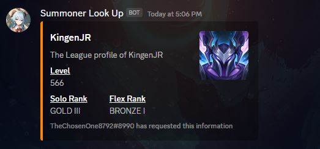
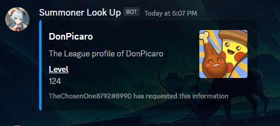
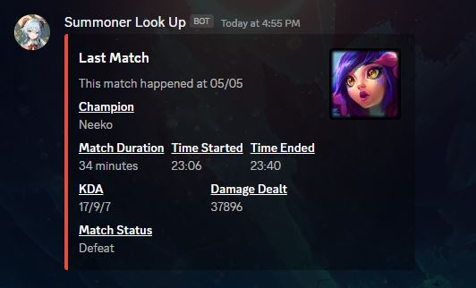
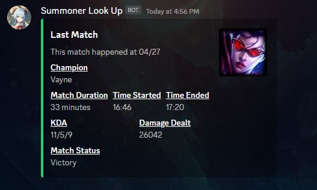
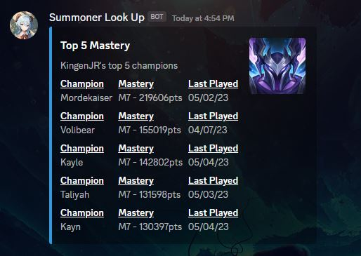
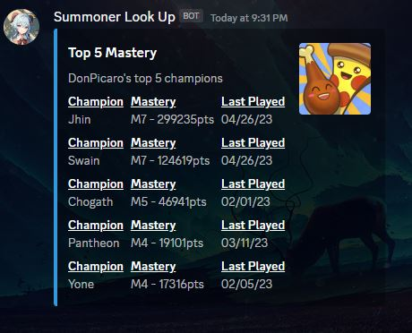
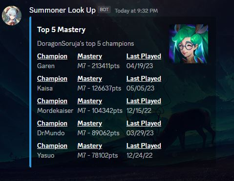

# Summoner Look Up Discord Bot

A discord bot that uses the Riot API to grab information about a specific league of legends player that the user asks for.

This bot has three main command. Profile, Last Match and Mastery. Each of them grabs different information but they all require the same input, an in-game name.

### Profile command - `!lolProfile`
But inputting the command along with an in-game name to get several things back.
1. Profile Picture
2. Level
3. Competitive Ranks

### Last Match command - `!lastMatch`
This command allows someone to check the performance of any player's last recorded match.

### Mastery command - `!mastery`
The final command allows you to check anyone's top five most played characters. Along with when they last played that character and how many points they have tied to that character.

